# Homework 9: Bamazon
This is Taylor Johnson's Homework 10: Bamazon for the Georgia Tech Coding Boot Camp. Bamazon is a command line interface (CLI) tool that allows customer to view and purchase products. It also has a manager mode which allows employees to view products (with a special function to view products with low inventory), add inventory for existing products, and add new products that have not yet been listed on Bamazon.

## Libraries/Packages Used
1. Vanilla JavaScript
2. Node.js
3. Inquirer - user command line input
4. MySQL - connecting and executing queries on MySQL databases
5. Colors - formatting of text in command line
6. CLI Table - formatting and displaying of tables in command line

## Methods
### Customer Mode
**1. Initial Connection to Database and Welcome Message**
    When the application initially loads, a connection is opened with the Bamazon database and the customer is presented a welcome message. The listProducts() function is immediately called to present all products for the customer.
    

**2. pickTask()**
    This function allows the customer to pick the task he/she wants to complete. The customer can choose to perform three tasks: Make a Purchase, List Products, or Quit Bamazon.
    
    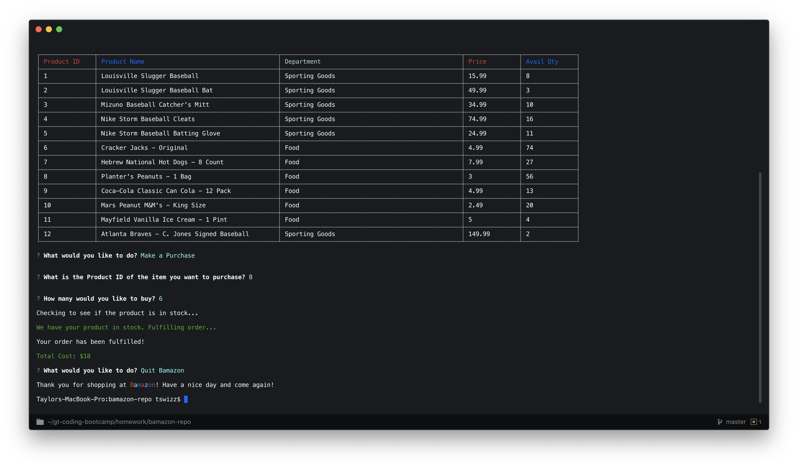

**3. listProducts()**
    This function allows the customer to view all products that Bamazon has to offer. It retrieves the products from the MySQL database and formats them into a table within the command line interface. It is also invoked when the application is initially started. The pickTask() function is called immediately after to allow the customer to pick his next task.
    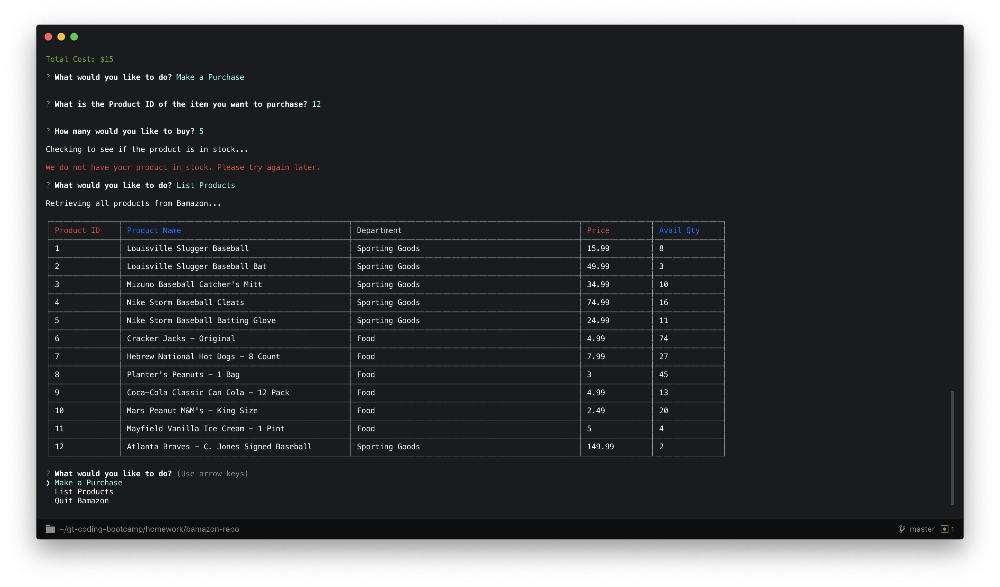

**4. buyProduct()**
    This function allows the customer to enter the following data to make a purchase: Product ID and quanity. It does not check to see if the product is in stock or fulfill the order. The checkSupply() function is called immediately after.
    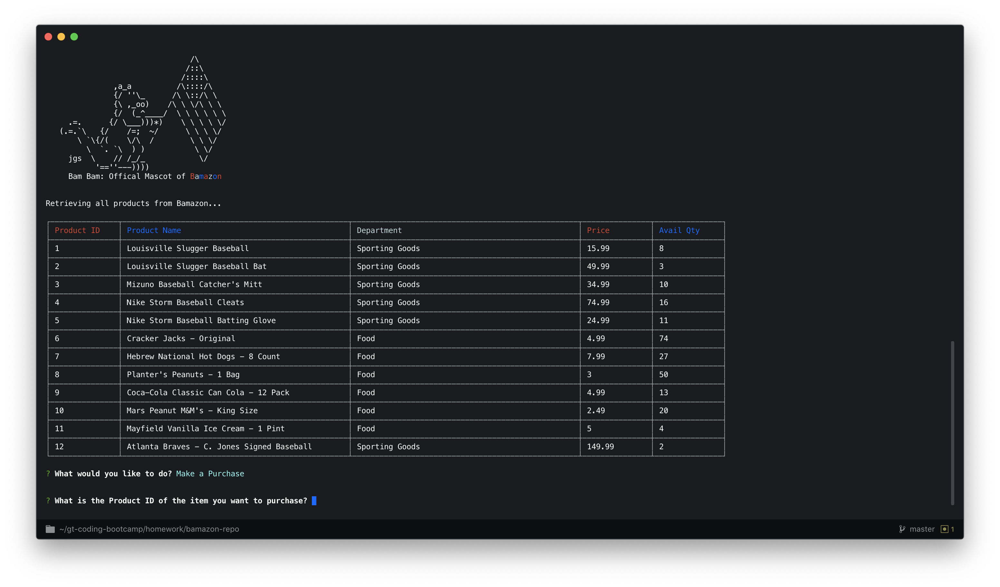
    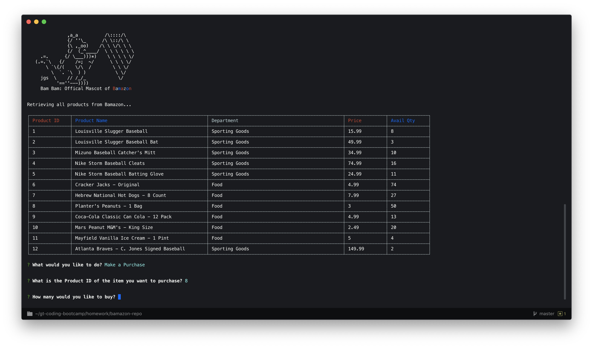

**5. checkSupply()**
    This function receives the data input by the customer from the buyProduct() function and then checks to verify if the product is in stock. It also validates that the customer has entered a valid Product ID. If the customer entered a valid Product ID and the product is in stock, then the fillOrder() function is called.
    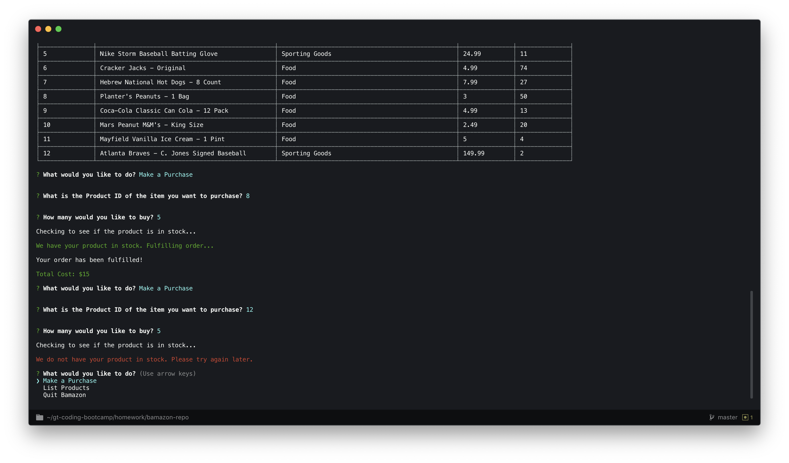

**6. fulfillOrder()**
    This function receives the following data from the checkSupply() function in its arguments: Product ID, purchase quantity, current in stock quantity, and price. Using this data, it calculates the new in stock quanity by subtracting the quantity the customer is purchasing. It also calculates the total cost by multiplying the purchase quantity and price. The database is updated with the new in stock quantity and the total cost is output to the customer. The pickTask() function is called immediately after to allow the customer to pick his next task.
    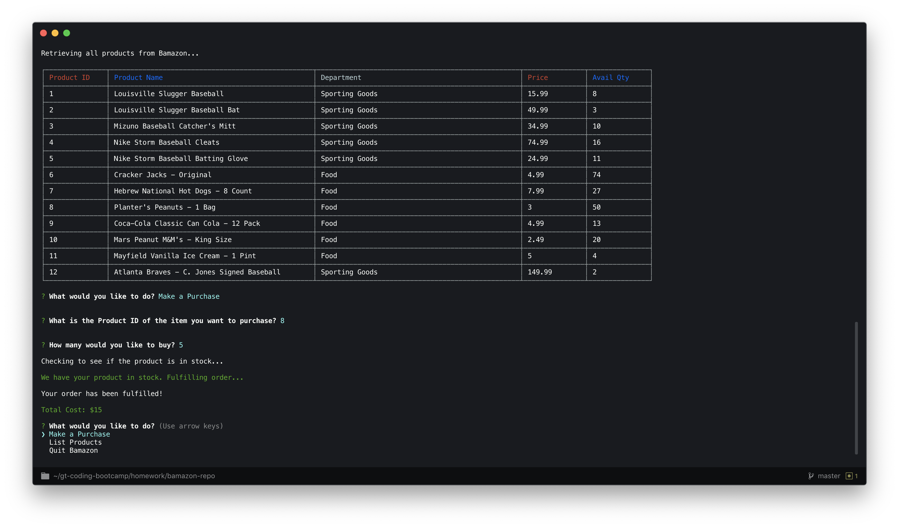

### Manager Mode
**1. Initial Connection to Database and Welcome Message**
    When the application initially loads, a connection is opened with the Bamazon database and the manager is presented a welcome message. The pickTask() function is immediately called to present the manager with a list of tasks he can perform.
    

**2. pickTask()**
    This function allows the manager to pick which task he would like to complete: List Products, View Low Inventory, Add Inventory, Add a New Product, or Quit Bamazon Manager Tool.
    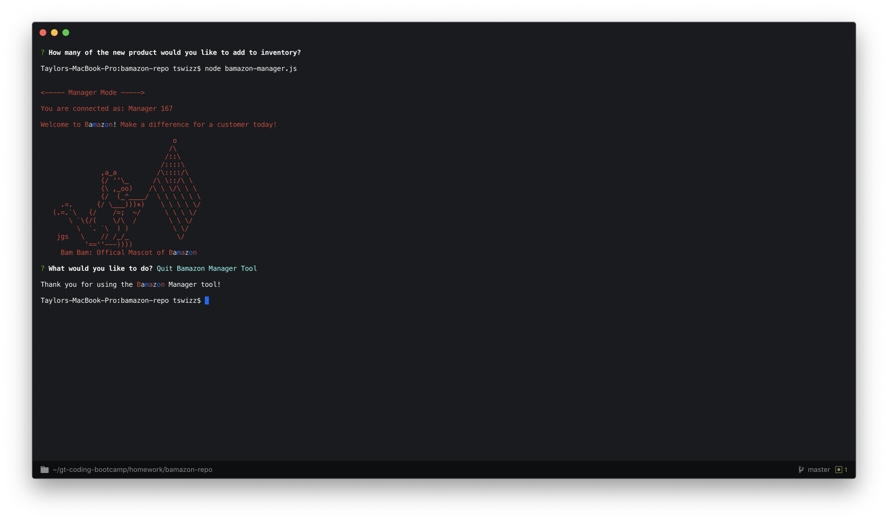

**3. listProducts()**
    This function allows the manager to view all products that Bamazon has to offer. It retrieves the products from the MySQL database and formats them in a table viewable within the command line interface. The pickTask() function is called immediately after to allow the manager to pick his next task.
    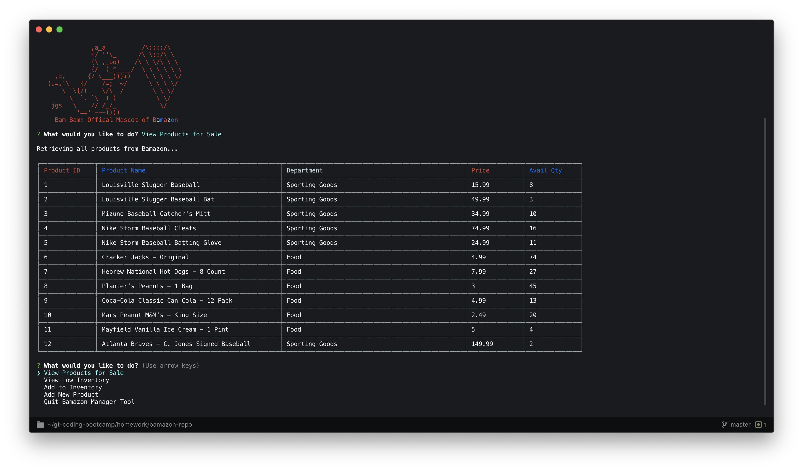

**4. viewLowInventory()**
    This function allows the manager to view all products with a stock quantity less than five. It retrieves the products from the MySQL database and formats them in a table viewable within the command line interface. The pickTask() function is called immediately after to allow the manager to pick his next task.
    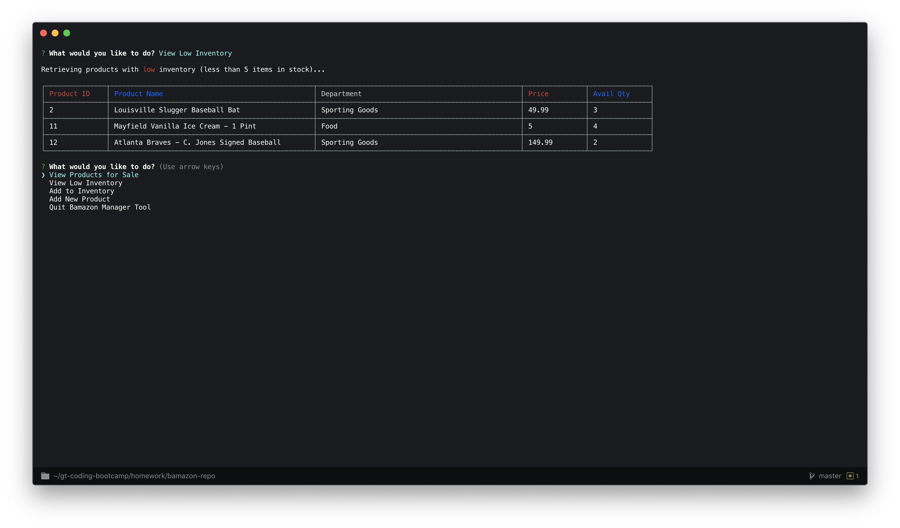

**5. addInventory()**
    This function allows the manager to add inventory for an existing product. The manager inputs the Product ID and quantity to add. The function checks that the Product ID entered by the manager is valid. If a valid Product ID is entered, then the function updates the MySQL database accordingly. The pickTask() function is called immediately after to allow the manager to pick his next task.
    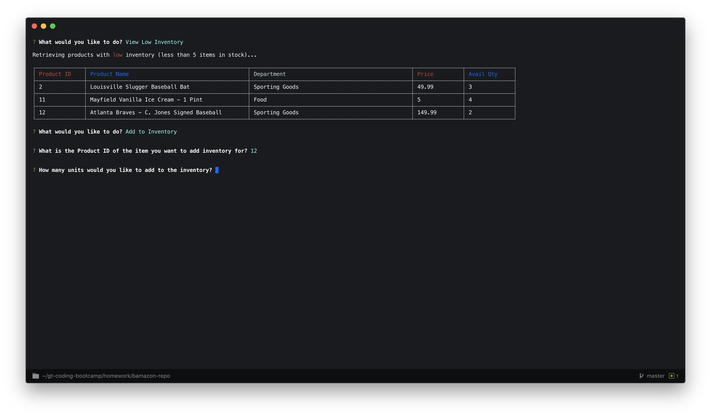
    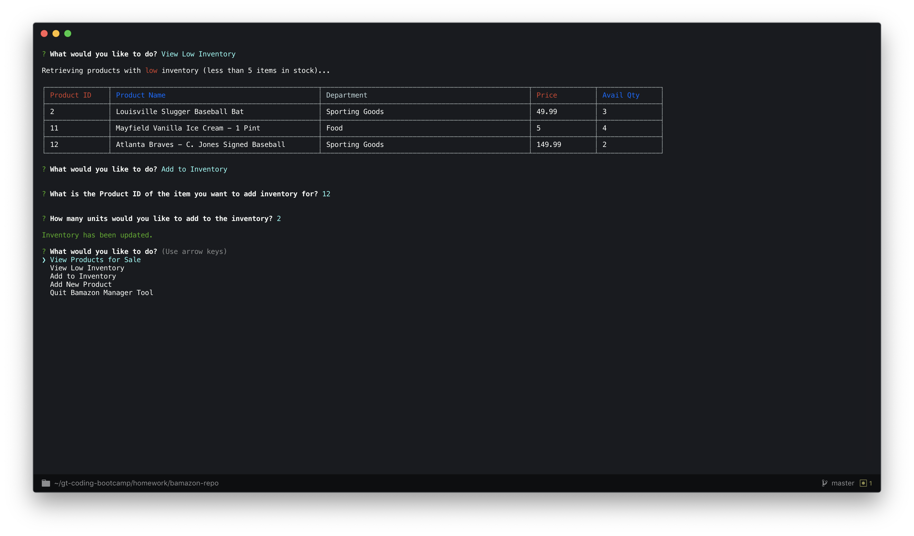
    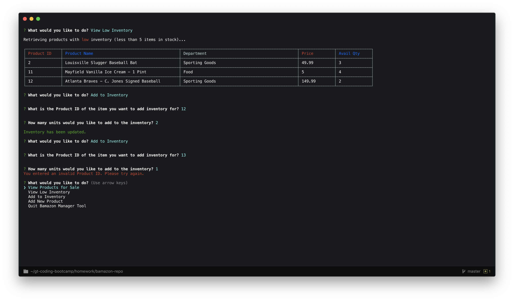

**6. addProduct()**
    This function allows the manager to add a new product to the MySQL database. The manager inputs the starting stock quantity, product name, department, and price. The database automatically assigns a valid Product ID. The pickTask() function is called immediately after to allow the manager to pick his next task.
    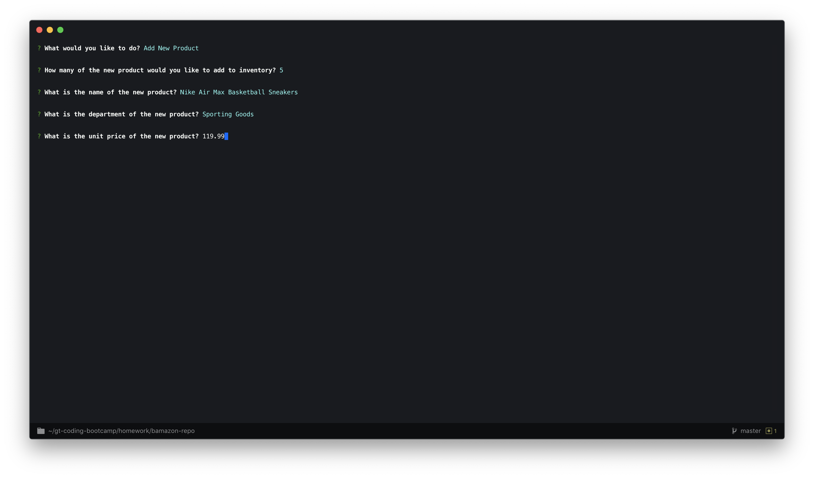
