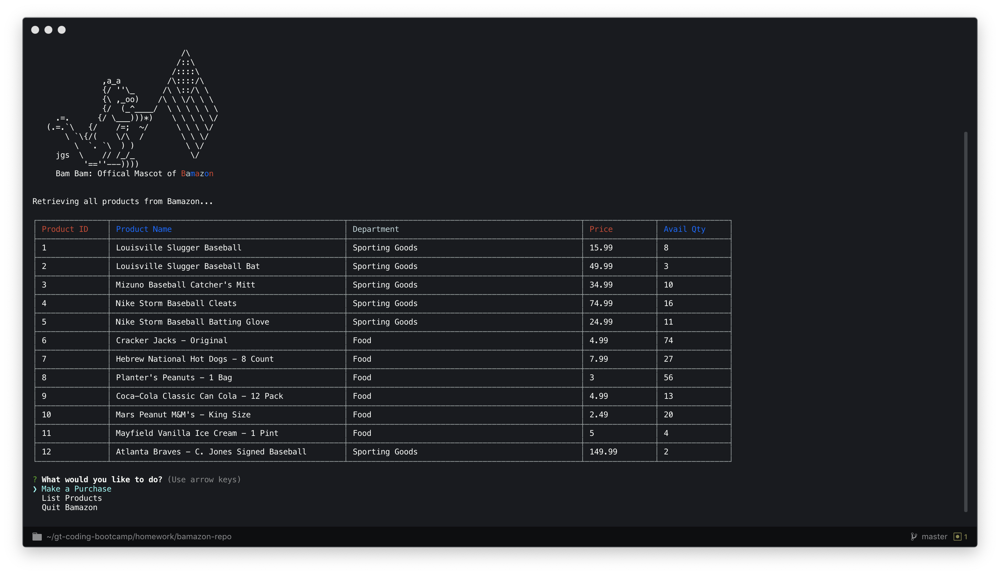

# Homework 9: Bamazon
This is Taylor Johnson's Homework 8: LIRI Bot for the Georgia Tech Coding Boot Camp. LIRI Bot is similar to Apple's Siri except that it takes input requests through the terminal command line. Specifically, LIRI Bot can perform four tasks:

## Libraries/Packages Used
1. Vanilla JavaScript
2. Node.js
3. Inquirer - user command line input
4. MySQL - connecting and executing queries on MySQL databases
5. Colors - formatting of text in command line
6. CLI Table - formatting and displaying of tables in command line

## Methods
### Customer Mode
**1. Initial Connection to Database and Welcome Message**
    When the application initially loads, a connection is opened with the Bamazon database and the customer is presented a welcome message. The pickTask() function is immediately called to list the products for the customer.
    

**2. pickTask()**
    This function allows the customer to pick the task he/she wants to complete. The customer can choose to perform three tasks:
    1. Make a Purchase
    2. List Products
    3. Quit Bamazon
    

### Customer Mode
**1. loginUser()**
    This function allows the user to log in and enter his/her name for personalization. This also is the initial funciton that is invoked to
    
**2. pickTask()**
    This function allows the user to pick the task he/she wants to complete. This is called recursively throughout the program by the
    
